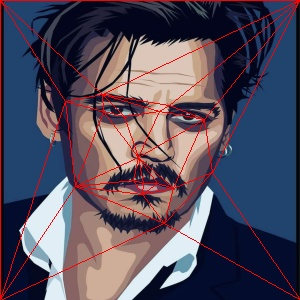
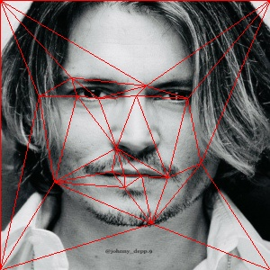

# Image-Morphing
Morphing is a special effect in motion pictures and animations that changes (or morphs) one image or shape into another through a seamless transition. Traditionally such a depiction would be achieved through dissolving techniques on film. Since the early 1990s, this has been replaced by computer software to create more realistic transitions.

# Main Images

  
  
  
  
  

# Detect Faces & Corresponding Points
 
 

# Results
See "res2.mp4" and "res2_1080.960.mp4" to see the results
